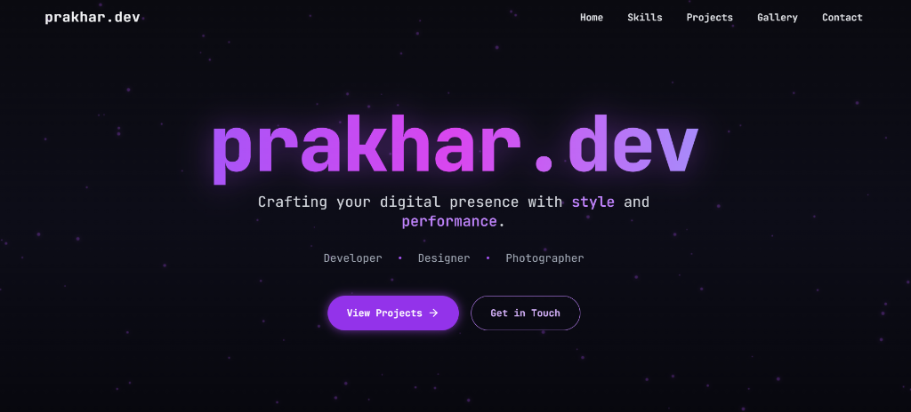

# prakhar.dev - Personal Portfolio

A modern, responsive, and fully interactive personal portfolio website showcasing my full-stack development projects, standard websites, games, and AI integrations. Built with performance and aesthetics in mind.



## 🚀 Live Demo
Visit the live portfolio: [prakhar.dev](https://prakharcodes.netlify.app/)

## ✨ Features
- **Modern UI/UX**: Sleek design with smooth animations using `Framer Motion` and `Tailwind CSS`.
- **Responsive Layout**: Fully optimized for mobile, tablet, and desktop devices.
- **Dynamic Project Showcase**: 
  - **Randomized Carousel**: Displays a fresh set of projects on every visit/refresh.
  - **Badge System**: Highlights "Top Picks" and "Featured" projects.
- **Categorized Projects Page**: Dedicated page filtering projects by Full-Stack, AI Tech, Games, and more.
- **Dark Mode**: Built-in support for theme switching (System/Dark/Light).
- **Interactive Elements**: Custom cursors, hover effects, and smooth scrolling navigation.

## 🛠️ Tech Stack
- **Framework**: [React](https://react.dev/) + [Vite](https://vitejs.dev/)
- **Language**: [TypeScript](https://www.typescriptlang.org/)
- **Styling**: [Tailwind CSS](https://tailwindcss.com/)
- **UI Components**: [Shadcn/ui](https://ui.shadcn.com/)
- **Icons**: [Lucide React](https://lucide.dev/)
- **Routing**: [React Router](https://reactrouter.com/)
- **Deployment**: Netlify / Vercel

## 📂 Featured Projects

### Full-Stack & AI
- **AskAI - Intelligent Chat SaaS**: A powerful AI chat app integrated with Google Gemini, supporting text, image, and document analysis. *(Top Pick)*
- **RenTelMe**: A premium rental property marketplace with secure listings and community insights. *(Work in Progress)*
- **Universal Video Downloader**: A tool to download videos from YouTube and Instagram (Reels/Posts).

### Standard Websites & Games
- **BrightSmile Dental**: A multi-language dental clinic website with appointment booking.
- **Elegant Spaces**: A luxury interior design studio portfolio.
- **Territory Clash**: A fast-paced capture-the-flag style strategy game.
- **Sagar Fitness**: Online fitness coaching platform.

## 🏃‍♂️ Getting Started

1. **Clone the repository**
   ```bash
   git clone https://github.com/blazecodeprakhar/portfolio.git
   cd portfolio
   ```

2. **Install dependencies**
   ```bash
   npm install
   ```

3. **Run the development server**
   ```bash
   npm run dev
   ```

4. **Build for production**
   ```bash
   npm run build
   ```

## 📬 Contact
- **Website**: [prakhar.dev](https://prakharcodes.netlify.app/)
- **Email**: [contact@prakhar.dev](mailto:contact@prakhar.dev)
- **GitHub**: [blazecodeprakhar](https://github.com/blazecodeprakhar)

---
© 2024-2026 Prakhar Yadav. All rights reserved.
